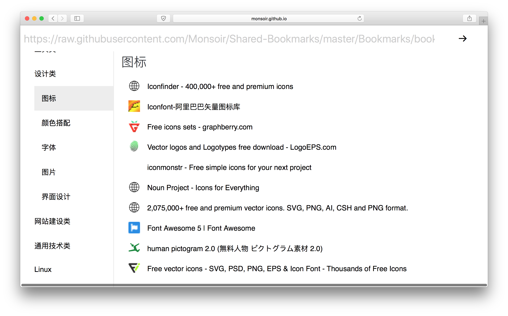

# 共享书签 Shared Bookmarks



## 简介

使用 React + React-Redux 进行构建的单页面应用

### Demo

[我的书签](https://monsoir.github.io/Shared-Bookmarks/)(只含部分数据)

书签数据示例 URL

- [https://raw.githubusercontent.com/Monsoir/Shared-Bookmarks/master/Bookmarks/bookmarks.json](https://raw.githubusercontent.com/Monsoir/Shared-Bookmarks/master/Bookmarks/bookmarks.json)

我的书签数据 URL

- [https://raw.githubusercontent.com/Monsoir/Shared-Bookmarks/master/Bookmarks/bookmarks2.json](https://raw.githubusercontent.com/Monsoir/Shared-Bookmarks/master/Bookmarks/bookmarks2.json)

### 本地安装

```sh
git clone https://github.com/Monsoir/Shared-Bookmarks.git
cd Shared-Bookmarks

npm install
npm start
```

## 书签数据 JSON 格式

从最顶上的 URL 中返回的数据需要满足一下格式

```json
{
    "title": "分类名称",
    "catelogs": [
        {
            "address": "书签地址",
            "name": "书签名字",
            "favicon": "书签网站的图标，选填，App 会通过网站规范进行获取",
            "remark": "对书签的备注，选填"
        },
        {
            "//": "..."
        }
    ],
    "categories": [
        {
            "title": "二级分类名称",
            "catelogs": [
                {
                    "//": "...",
                }
            ],
            "categories": []
        }
    ]
}
```

## 生成书签数据并上传文件

可以使用 [Safari bookmarks jsonizer](https://github.com/Monsoir/safari-bookmarks-jsonizer) 进行生成

1. 利用 Safari 内置的书签导出功能，生成 `Safari Bookmarks.html` 文件
2. 安装 Safari bookmarks jsonizer, 使用的是 Python 3.6.3 开发，所以最好还是使用 Python 3 虚拟环境来安装吧

    ```sh
    virtualenv --no-site-packages env
    source env/bin/active
    pip insstall safari-bookmarks-jsonizer
    ```

3. 生成 JSON 文件

    ```sh
    jsonize -i ~/Downloads/Safari\ Bookmarks.html -o ~/Downloads/result.json
    ```

4. 对 JSON 文件修改，删除不想共享的书签
5. 将最后的 JSON 数据上传到可以直接访问的服务器，如 [Github](https://github.com), [myjson](http://myjson.com)

## Todo

- [x] 编写脚本，自动将 Safari 中的书签信息整理成上面的 JSON 格式

